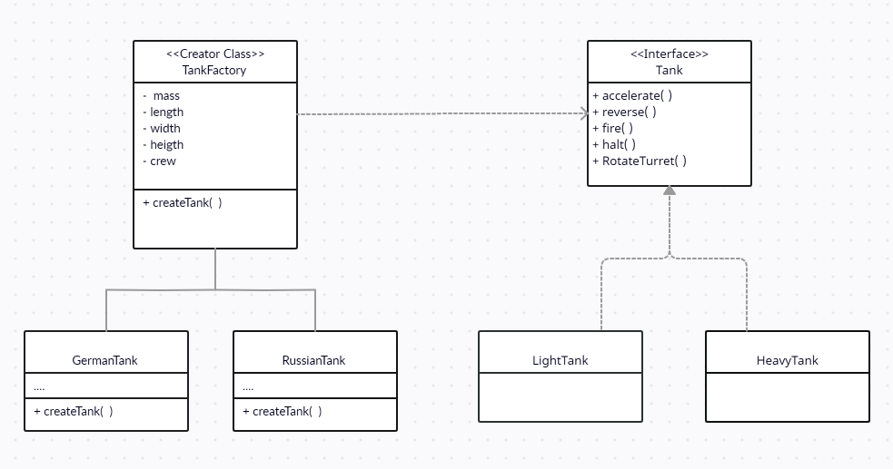

## What is Factory method ?

- Factory method provides an interface for creating objects using a separate "method"
  in the same class, which also enables sub-class to alter the type of objects created.
  
- This makes it very powerful when it comes to making of specialized 
  product objects.
- An abstract super-class with a special method that creates objects, a sub-class that 
  inherits from the super-class and overrides the object creation method to its specific need.

## Blue-print to implement Factory Method

- The **product** declares the interface, which is common to all objects that can be produced by
  the creator and its subclasses.
  
- The **creator** class declares the factory method that creates and return product objects.
  Ensure that the return type of this method matches the product interface.
  
- The **concrete-creators** inherits from the creator class and overrides the object creation method
  specific to its needs. 

  
## When to use it and Why to use it ? 

- Factory method separates product construction code from the code that actually 
  uses the product.
  
- Factory method is useful when you don't know beforehand exact type of object your
  code would need.
  
- Factory method should be used when you want to provide users of your library or frame-work
  with a way to extend its internal components. 
  
- This method is also saves systems resources by reusing existing objects instead of
  rebuilding them all the time.
  
## Pros

- Loosely coupled design between the creator class and concrete products.

- Adheres to **single responsibility principle**, you move product creation code
  into one place in the program making the maintenance easier.
  
- **Open/Close principle**, make the code open for extension and closed for modification.
  You can add new types of products into the program without breaking existing code.
