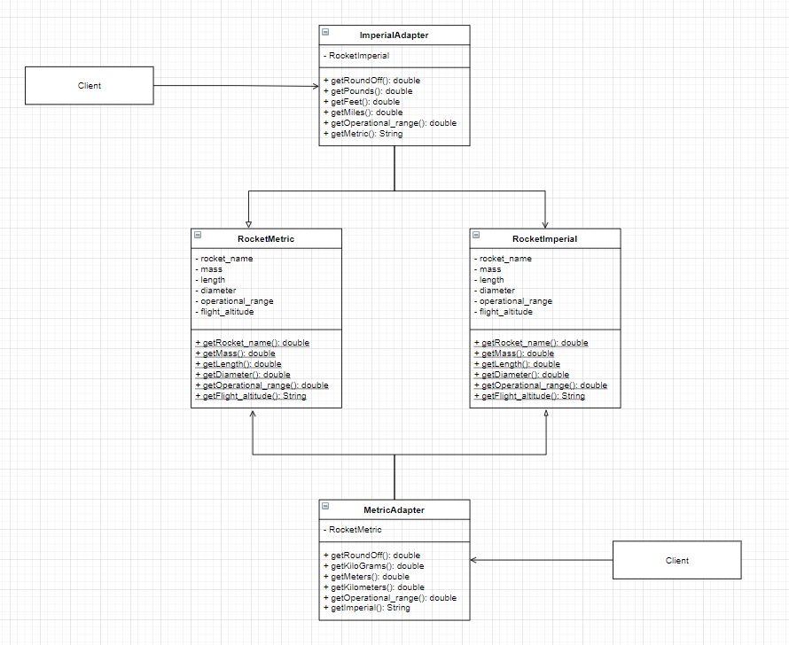

## What is Adapter pattern ?

- Adapter is a structural design pattern which facilitates communication by 
  providing a compatible interface between two different in-compatible software components / systems.
  
- This frequently happens when a pre-existing system needs to incorporate 3rd party libraries,
  or needs to connect to other systems.

- The adapter design pattern consists of several parts:
    - **Client class**: This class is the part of your system that wants to use a 3rd party 
      library or external system.
    - **Adaptee class**: This is the 3rd party library or external system that you want to use.
    - **Adapter class**: The class that sits between the client and the adaptee.

## Blue-print to implement Adapter pattern
- **Design the target interface**: This interface will be implemented by the adapter class.
- **Implement the target interface to the adapter class**: The adapter class provides the methods that
  will take the client class's object and convert them to the type the adaptee class requires.
  It will also convert the Adaptee's object ot the type Client class requires.
  
- **Send requests using target interface**: Client class uses the target interface to send request
  to the adapter.
  

## Pros
- **Adheres to Single-responsibility principle**: You can separate the interface or data conversion
  code from the primary business logic of the program.
  
- **Open/Close Principle**: You cna introduce new types of adapters in program without breaking 
  existing code, as long as they work with the adapters through the client interface. 
