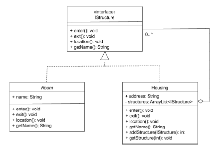

## What is Composite pattern ?
- It's a structural design pattern that lets you compose objects into tree structures 
  and then work with these tree structures as if they were individual objects
  
## Blue-print to implement Adapter pattern

- **Design the interface**: This interface will be implemented by the Composite, and the
  leaf classes. This supports **polymorphism** for your component and leaf classes
  
- **Implement Composite class**: Implement the interface in the composite class. This
  will give housing class its own behaviour when client code uses it.
  
- **Implement Lead class**: This class does not contain any components, and does not have
  a collection of components added to it.

## When to use it and Why to use it ?

- Use this pattern when you have to implement a tree-like object structure.

- When you want the client code to treat both simple and complex objects

## Pros
- Allows you to work conveniently with complex tree structures.

- Open/Close principle: New elements can be introduced without breaking
  the existing code, which works with the object tree.
  
## Cons
- Can be difficult to provide a common interface for classes.
