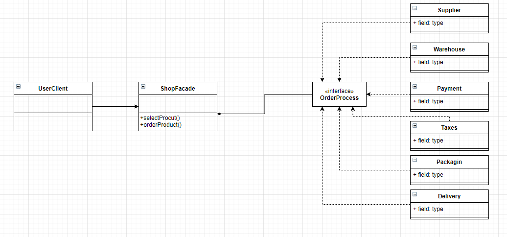

## What is Facade pattern ?
- Facade is a structural pattern that provides a single, simplified interface 
  for client classes to interact with a sub-system.
  
- Facade is a wrapper class that encapsulates a sub-system in order to hide 
  the sub-system's complexity, and acts as a point of entry into the subsystem withouy
  adding more functionality itself.

## Blue-print to implement Facade Method
- **Design the interface**: Create an interface that will implemented by different
  sub-system classes but not by the client class.
  
- **Implement the interface**: Implement the interface to the classes which will 
  be wrapped with the facade class.
  
- **Create a facade class**: This facade class will wrap the classes that implement
  the interface.
  
- **Create additional facade classes**: Its very important not to populate all complex
  sub-systems to just one facade class, but to create others to balance in such cases of
  very complex sub-systems.
  
- **Use the facade class**: Client class can now access the sub-system classes through
  the facade class without any complexity.

## When to use it and Why to use it ?
- When working / creating complex libraries and APIs.

  